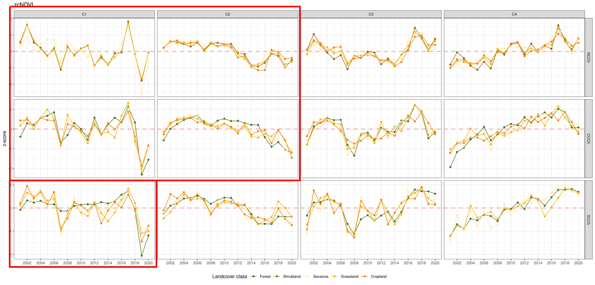

class: inverse center middle

```{r setup, include=FALSE}
options(htmltools.dir.version = FALSE)
library(xaringanExtra)

knitr::opts_chunk$set(
  fig.width=9, fig.height=3.5, fig.retina=3,
  out.width = "100%",
  cache = FALSE,
  echo = TRUE,
  message = FALSE, 
  warning = FALSE,
  hiline = TRUE
)

```

```{r xaringan-themer, include=FALSE, warning=FALSE}
library(xaringanthemer)
style_duo_accent(
  primary_color = "#1381B0",
  secondary_color = "#FF961C",
  inverse_header_color = "#FFFFFF",
  title_slide_text_color = "#72AD8F"
)

```

```{r xaringanExtra-setup, echo=FALSE}
xaringanExtra::use_xaringan_extra(c("fit_screen", "logo"))
xaringanExtra::use_fit_screen()

xaringanExtra::use_logo(
  image_url = "https://i.ibb.co/W05VNqL/logo-hemera-umayor.png",
  link_url = "https://i.ibb.co/W05VNqL/logo-hemera-umayor.png",
  position = xaringanExtra::css_position(top = "1em", right = "1em")
)
```


# 1 Contexto
---
## 1.1 Cambio Climatico

```{r, echo=FALSE, out.width="40%",fig.align='center'}
knitr::include_graphics("figs/climate_change.gif")
```

```{r, echo=FALSE, out.width="40%",fig.align='center'}

```


---
## 1.2 Cuenca Río Aconcagua: Lago Peñuelas

```{r, echo=FALSE, out.width="80%",fig.align='center'}

```


---
## 1.3 Cuenca Río Aconcagua: cambio uso de suelo
.pull-left[

]
.pull-right[

]

---
## 1.4 Objetivos

### General

Estudiar la sequía en Chile Central basado en datos satelitales de disponibilidad y demanda de agua entre 2000-2022 considerando la temporada de desarrollo de la vegetación.


### Específicos

- Analizar la interrelación entre precipitación y proxy de productividad de la vegetación.

- Analizar la interrelación entre evapotranspiración y proxy de productividad de la vegetación.

- Analizar los cambios en la cobertura de la vegetación .


---
class: inverse center middle

# 2 Métodos

---
background-image: url("figs/map_study_area_join.png")
background-position: 50% 50%
background-size: contain

## 2.1 Área de Estudio

---
## 2.2 Datos

- Estimaciones de precipitación
  - CHIRPS 2.0: 1981-ahora, 5 km resolución espacial

- Vegetación
  - Landcover MODIS `MCD12Q1.006`: 2000-2019, anual, 500 m RE (resolución espacial)
  - Fenología MODIS `MCD12Q2.006`: 2000-2019, 500 m RE
  - Índices de Vegetación MODIS `MOD13A2.006`: 2000-ahora, 16 días, 1 km RE
  - Evapotranspiración MODIS `MOD16A2.006`: 2000-ahora, 8 días, 500 m RE
  - Cobertura de Vegetación MODIS `MOD44B.006`: 2000-ahora, anual, 250 m RE  

---
## 2.3 Variables

- Precipitación
  - Índices Estandarizado de Precipitacion (SPI) 3, 6, 12 y 24 meses.

- Vegetación
  - NDVI acumulado en la temporada (zcNDVI)
  - ET acumulada en la temporada (zcET)
  - Porcentaje de pixel sin vegetación (PNV)
  
---
## 2.4 Periodo de análisis a nivel de pixel

.pull-left[
```{r, echo=FALSE, out.width="125%"}

```
]
.pull-right[
```{r, echo=FALSE, out.width="75%"}
knitr::include_graphics("figs/landcover_sos_eos.png")
```
]

---
class: inverse center middle

# 3 Resultados

---
## 3.1 Precipitación

```{r, echo=FALSE, out.width="75%",fig.align="center"}

```

```{r, echo=FALSE, out.width="75%",fig.align="center"}

```

---
## 3.2 Proxy de productividad de la vegetación

```{r, echo=FALSE, out.width="90%",fig.align="center"}

```

---
## 3.3 Landcover

```{r, echo=FALSE, out.width="75%",fig.align="center"}

```

---
## 3.3 Proxy de productividad de la vegetación

```{r, echo=FALSE, out.width="100%",fig.align="center"}

```

---
## 3.3 Evapotranspiración

```{r, echo=FALSE, out.width="100%",fig.align="center"}

```

---
## 3.3 Porcentaje sin vegetación (PNV)

```{r, echo=FALSE, out.width="100%",fig.align="center"}

```

---
## 3.4 $R^2$ zcNDVI vs SPIs

```{r, echo=FALSE, out.width="75%",fig.align="center"}

```
---
## 3.5 $R^2$ zcNDVI vs ET

.pull-left[
- La correlación entre productividad y demanda de agua (ET) presenta un patron longitudinal.

- En la zona centro norte la variación temporal en la productividad (zcNDVI) está siendo explicada (>80%) por la variación en la demanda de agua (ET).

- Los valores de $R^2$ estarían relacionados a la disminución de la disponibilidad de agua (ej., lluvia, aguas subterránes) en la zona centro norte y en menor medida a una disminución en la cobertura de vegetación.

]

.pull-right[
```{r, echo=FALSE, out.width="30%",fig.align="center"}

```
]

---
class: inverse center middle

# ¿Qué sigue?

---
background-image: url("figs/anim_dem_aconcagua.gif")
background-position: 50% 50%
background-size: contain
